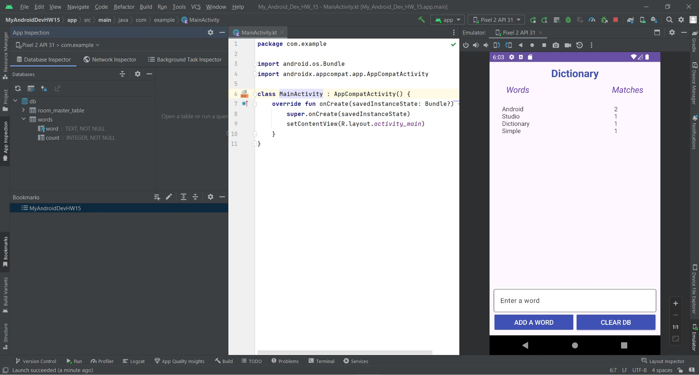
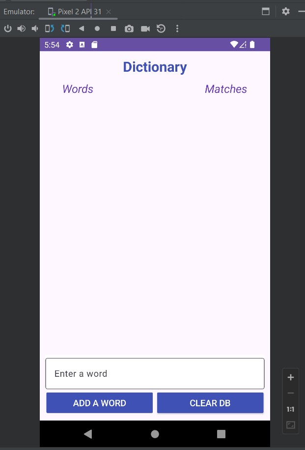
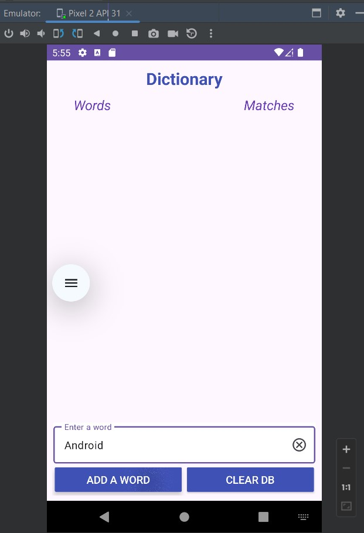
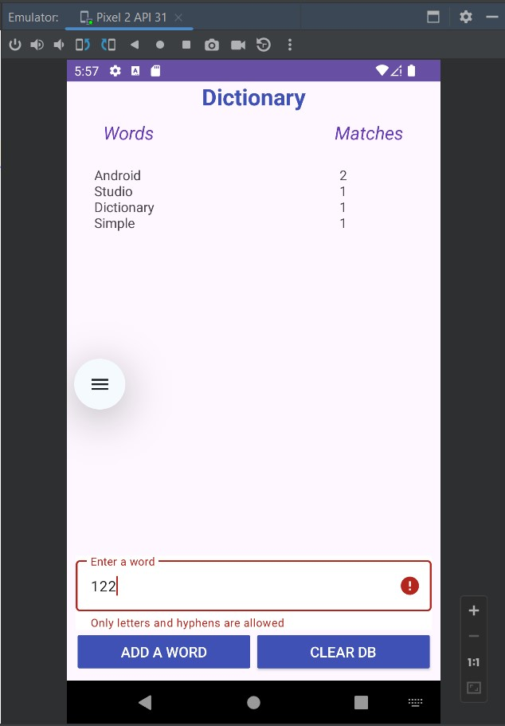
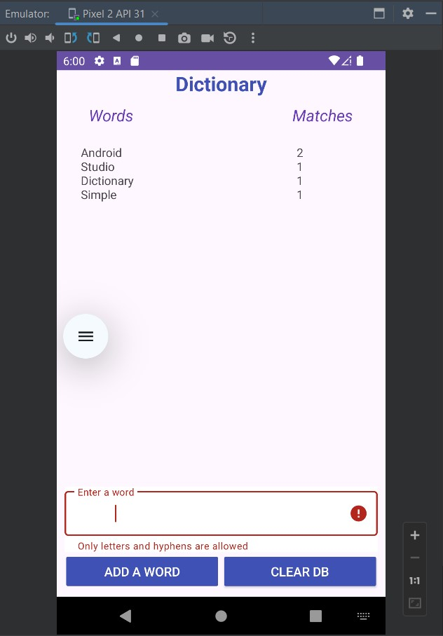

# Урок 15. Работа с БД (Room)

### Цель практической работы:
Применить знания по БД, SQL и Room.

### Что нужно сделать
1. Напишите мини-приложение для подсчёта слов. Интерфейс должен позволять добавлять в словарь новое слово, 
   просматривать список первых слов в словаре, искать количество совпадений, а также очищать данные приложения.
2. Создайте базу данных, используя Room.
3. В качестве модели необходимо объявить сущность, содержащую слово (оно же используется в качестве ключа) 
   и количество его повторений.
4. На главный экран добавьте TextInput и кнопку «Добавить». Нажимая на неё, мы должны либо добавлять 
   новое слово в словарь (если оно не встречается), либо увеличивать счётчик повторений на единицу.
5. Подпишитесь на обновление таблицы, используя flow. Добавьте на экран текстовое поле, куда будут 
   выводиться первые пять встречающихся слов.
6. Добавьте кнопку «Очистить», нажатие на которую удаляло бы все данные из БД.
7. Добавьте проверку на ввод слова. Необходимо блокировать добавление пустых строк и слов, содержащих пробелы, 
   цифры, точки и запятые (допустимы только буквы и дефисы). При попытке пользователя добавить 
   такое сочетание выводите соответствующее сообщение на экран.

===========================================================================================================

## Демонстрация решения:

